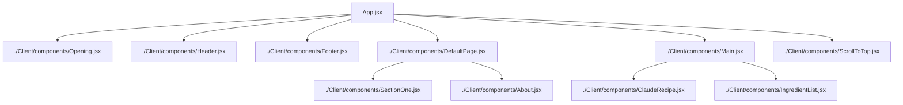
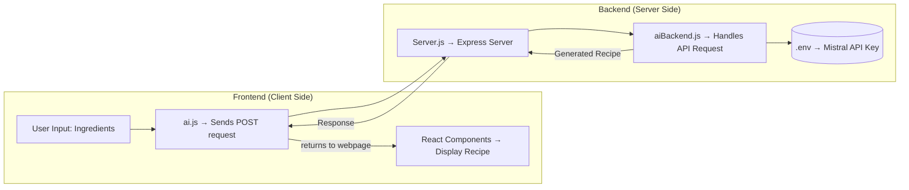

# 🍳 FlavorForge — Recipe Generator Website

**FlavorForge** is your digital kitchen assistant that helps you turn random ingredients into magical recipes ✨  
Just add your ingredients, hit **"Create Magic"**, and boom — your AI-powered recipe appears, generated via **Mistral API**!

---

## 🧠 Tech Stack

**Frontend:**
- React.js ⚛️  
- Tailwind CSS 💨  
- Bootstrap 🎨  
- Vanilla CSS  

**Backend:**
- Node.js  
- Express.js  
- Mistral API (via Hugging Face Inference)

---

## Frontend overview

### 🧩 React Component Structure

Below is the architecture of the frontend built with React — it’s clean, modular, and scalable:

## ⚙️ Backend Overview

The backend is minimal — mainly for security purposes.
While the Mistral API can be directly used in the frontend, doing so risks exposing your API key, as it can still be retrieved from the JavaScript bundle via DevTools.
To protect that, the API key is stored securely inside a .env file in the backend.

### Backend Flow

**1. Server.js:** 

- Main backend file.
- Handles the POST request from the frontend.
- Deployed on Render.

**2. aiBackend.js:**

- Handles the actual Mistral API call (via Hugging Face Inference).
- Returns the generated recipe text to Server.js.

**3. ai.js (Frontend - inside /Client)**

- Sends a POST request to the deployed backend URL.
- Retrieves the response (recipe) and displays it dynamically on the page.

### 🧱 Backend Architecture Diagram

## 🧑‍💻 What I Learned

During this project, I gained hands-on experience in both frontend and backend fundamentals:

***🖥️ Frontend Skills***

- useState, useEffect, useRef, and React props
- React Routers for page navigation
- Component structuring and reusability
- Tailwind + Bootstrap + CSS integration
- Scroll handling and smooth transitions

***🛠️ Backend Skills***

- Node.js and Express.js basics
- Handling GET and POST requests
- Using .env files for security
- Avoiding CORS errors
- try...catch error handling
- Understanding the flow of API calls (frontend → backend → external API)

***☁️ Deployment***

- Frontend: Deployed using Vercel
- Backend: Deployed using Render

## 🚀 Future Improvements

- 🔐 Add User Authentication (Login/Signup)
- 💾 Enable User Histories (to view past recipe generations)
- ❤️ Add Favorites or “Save Recipe” feature
- 🧠 Integrate AI image generation for dishes

## 👤 Useful Links

- 👤 Auther: *Abinash Dash*
- **</>** GitHub: [@AbiDev2003](https://github.com/AbiDev2003)
- **[in]** LinkedIn: [Abinash Dash](https://linkedin.com/in/abinashDev)
- 🔗 Website Live Link: [flavorforge](https://flavor-forge-recipe.vercel.app/)

### Blogs (Journey & Challenges faced in this project) 

- [curtain animation glitch](https://react-curtain-animation-bug.hashnode.dev/fixing-the-curtain-reveal-animation-glitch-in-react)
- [deployment error 404](https://deployment-error-404-imagenotloading.hashnode.dev/fixing-the-deployment-error-404-image-error-after-deploying-react-app-on-vercel)
- [object mapping in react for ui rendering](https://object-mapping-in-react.hashnode.dev/object-mapping-the-most-common-style-used-in-react-for-rendering-ui-elements)
- [correct and secure location of .env file before deploying](https://env-file-location-before-deploy.hashnode.dev/where-to-keep-the-env-file-before-deploying-the-secure-way)

---

⭐ Let's connect and grow together !